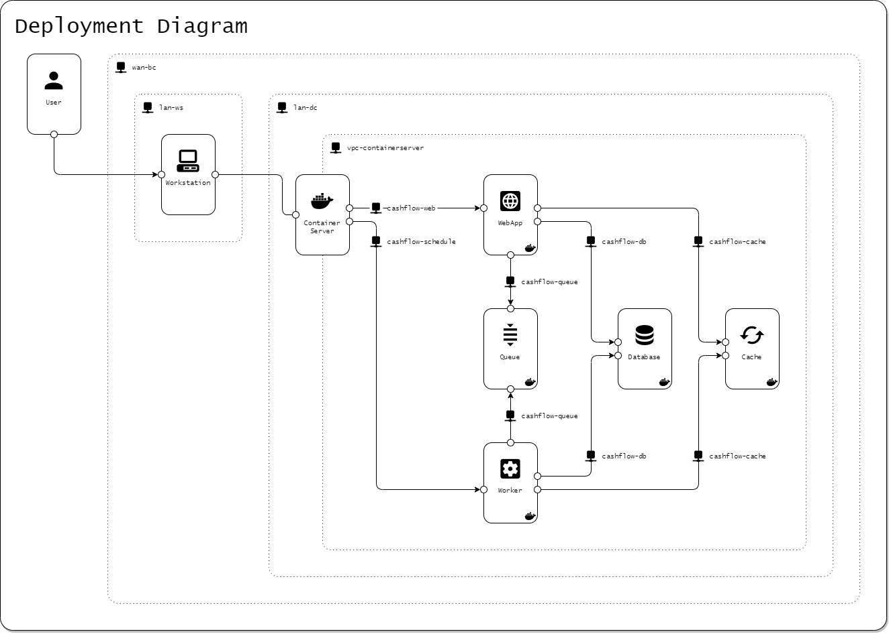
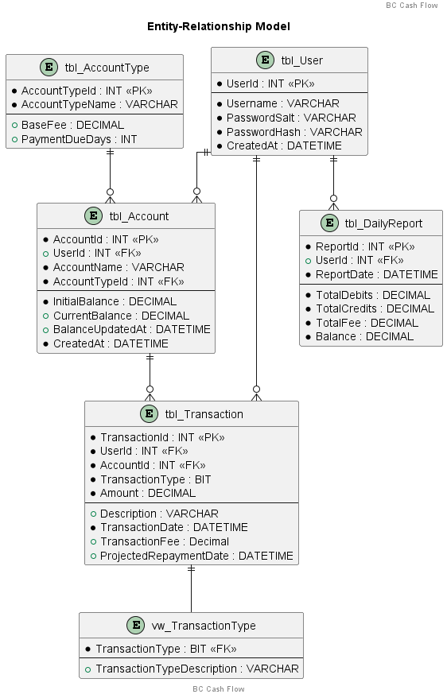
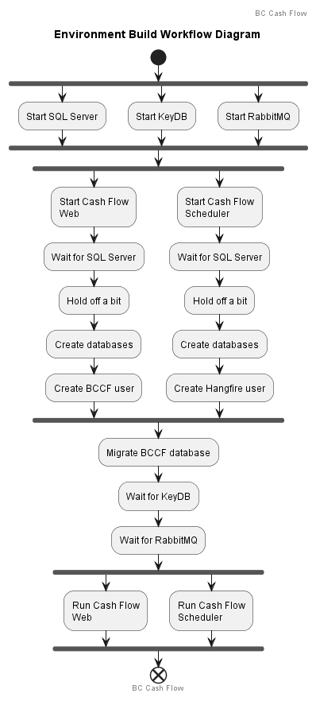

# BC Cash Flow

## Tabela de Conteúdo

- [Descrição](#descrição)
- [Funcionalidades](#funcionalidades)
- [Tecnologias Utilizadas](#tecnologias-utilizadas)
- [Requisitos para Execução](#requisitos-para-execução)
- [Como Rodar o Projeto Localmente](#como-rodar-o-projeto-localmente)
- [Estrutura do Projeto](#estrutura-do-projeto)
- [Teste de carga](#teste-de-carga)
  - [Relatórios de execução de teste de carga](#relatórios-de-execução-de-teste-de-carga)
    - [Run 001](#run-001)
- [Diagrama de Implantação](#diagrama-de-implantação)
- [Modelo Entidade-Relacional](#modelo-entidade-relacional)
- [Fluxo de Construção do Ambiente](#fluxo-de-construção-do-ambiente)
- [Registros de Decisão Arquitetural](#registros-de-decisão-arquitetural)
  - [ADR001 - Interface](docs/adr/adr001-interface.md)
  - [ADR002 - Arquitetura](docs/adr/adr002-arquitetura.md)
  - [ADR003 - Banco de dados](docs/adr/adr003-banco-de-dados.md)
  - [ADR004 - Banco de dados](docs/adr/adr004-banco-de-dados.md)
  - [ADR005 - Evolve DB Docker](docs/adr/adr005-evolve-db-docker.md)
  - [ADR006 - Database Setup](docs/adr/adr006-database-setup.md)
  - [ADR007 - Migration tiers](docs/adr/adr007-migration-tiers.md)
  - [ADR008 - Cross Cutting](docs/adr/adr008-cross-cutting.md)
  - [ADR009 - Localization](docs/adr/adr009-localization.md)
  - [ADR010 - Business](docs/adr/adr010-business.md)
  - [ADR011 - Startup context builder](docs/adr/adr011-startup-context-builder.md)
  - [ADR012 - Hangfire antiforgery token](docs/adr/adr012-hangfire-antiforgery-token.md)
  - [ADR013 - Setup](docs/adr/adr013-setup.md)
- [Licença](#licença)

## Descrição

O BC Cash Flow é um sistema desenvolvido em C# para o controle de fluxo de caixa |  permitindo a gestão de lançamentos
diários de débitos e créditos, além da consolidação do saldo diário. O sistema é projetado com foco em escalabilidade,
resiliência e segurança, garantindo alta disponibilidade e desempenho.

## Funcionalidades

- Registro de Lançamentos: Adicione lançamentos de débito e crédito com descrição, valor e data.
- Consolidação de Saldo Diário: Gere um relatório consolidado do saldo diário.
- Resiliência: O sistema de lançamentos opera de forma independente, mesmo com falhas no serviço de consolidação.
- Escalabilidade: Suporte para alta demanda de requisições nos momentos de pico.

## Tecnologias Utilizadas

- C#
- .NET Core
- SQL Server (ou outro banco de dados relacional)
- RabbitMQ
- Redis
- Hangfire
- Evolve
- JMeter

## Requisitos para Execução

- Docker Compose

## Como Rodar o Projeto Localmente

1. Clone o repositório:

```bash
git clone https://github.com/mfedatto/bc-cashflow.git
```

2. Navegue até o diretório de infra como código:

```bash
cd iac
```

3. Suba a composição via docker compose:

```bash
docker compose up -d
```

## Estrutura do Projeto

- `/docs/`: Documentação técnica do projeto.
- `/src/`: Código fonte do sistema.
- `/iac/`: Infra como código.
- `/db/`: Database migration.
- `/tests/`: Planos de teste.

## Teste de carga

O teste de carga foi criado usando JMeter e as definições estão no arquivo `/tests/load-test.jmx`.

### Relatórios de execução de teste de carga

#### Run 001

Ambiente novo, construído totalmente pelo `docker compose up -d`.

##### Host

- Intel Core i7-9700KF CPU @ 3.60/4.90GHz (stock) 8 cores
- 64,0 GB RAM
- Windows 11 amd64

##### Containers

| Component | Tecnology            | Hostname             | CPUs  | RAM (MB) |
| :-------- | :------------------- | :------------------- | ----: | -------: |
| Web UI    | ASP.Net 8            | `cashflow-web`       | `1.0` |    `256` |
| Scheduler | ASP.Net 8 + Hangfire | `cashflow-scheduler` | `0.2` |    `128` |
| Database  | SQL Server           | `cashflow-db`        | `1.0` |   `1536` |
| Cache     | KeyDB (Redis)        | `cashflow-cache`     | `0.6` |     `64` |
| Queue     | RabbitMQ             | `cashflow-queue`     | `0.2` |    `128` |

##### Setup

- Warmup
  - Threads: `3`
  - Ramp-up period: `0`
  - Loop count: `3`
  - Infinte: `false`
  - Same user in each iteration: `true`
  - Delay Thread creation until needed: `false`
  - Specifiy Thread lifetime: `false`
  - Duration (seconds): `disabled`
  - Startup delay (seconds): `disabled`
- Load test
  - Threads: `10`
  - Ramp-up period: `0`
  - Loop count: ``
  - Infinte: `true`
  - Same user in each iteration: `true`
  - Delay Thread creation until needed: `false`
  - Specifiy Thread lifetime: `true`
  - Duration (seconds): `120`
  - Startup delay (seconds): `0`

##### Results

| Label                       | # Samples | Average | Min  | Max    | Std. Dev. | Error %  | Throughput  | Received KB/sec | Sent KB/sec | Avg. Bytes |
| :-------------------------- | --------: | ------: | ---: | -----: | --------: | -------: | ----------: | --------------: | ----------: | ---------: |
| `GET /`                     |    `5905` |     `2` |  `0` |   `68` |    `5.36` | `0.000%` |  `49.23295` |        `150.15` |      `5.72` |   `3123.0` |
| `GET /Users`                |    `5905` |     `9` |  `0` | `1000` |   `23.08` | `0.000%` |  `49.23541` |        `170.02` |      `5.96` |   `3536.0` |
| `GET /Users/Details/1`      |    `5905` |     `6` |  `0` |   `80` |   `10.99` | `0.000%` |  `49.21407` |        `167.30` |      `6.44` |   `3481.0` |
| `GET /Accounts`             |    `5904` |     `9` |  `1` | `1836` |   `38.04` | `0.000%` |  `49.21682` |        `191.20` |      `6.10` |   `3978.0` |
| `GET /Transactions`         |    `5903` |    `60` |  `4` |  `314` |   `38.25` | `0.000%` |  `49.19372` |        `808.00` |      `6.29` |  `16819.1` |
| `POST /Transactions/Create` |    `5901` |    `99` | `19` | `3912` |  `179.16` | `0.000%` |  `49.17623` |        `814.54` |     `19.83` |  `16961.2` |
| TOTAL                       |   `35423` |    `31` |  `0` | `3912` |   `85.23` | `0.000%` | `295.05397` |       `2299.82` |     `50.32` |   `7981.7` |

#### Run 002

Ambiente novo, construído totalmente pelo `docker compose up -d`.

##### Host

- Intel Core i7-9700KF CPU @ 3.60/4.90GHz (stock) 8 cores
- 64,0 GB RAM
- Windows 11 amd64

##### Containers

| Component | Tecnology            | Hostname             | CPUs  | RAM (MB) |
| :-------- | :------------------- | :------------------- | ----: | -------: |
| Web UI    | ASP.Net 8            | `cashflow-web`       |   n/a |      n/a |
| Scheduler | ASP.Net 8 + Hangfire | `cashflow-scheduler` |   n/a |      n/a |
| Database  | SQL Server           | `cashflow-db`        |   n/a |      n/a |
| Cache     | KeyDB (Redis)        | `cashflow-cache`     |   n/a |      n/a |
| Queue     | RabbitMQ             | `cashflow-queue`     |   n/a |      n/a |

##### Setup

- Warmup
  - Threads: `3`
  - Ramp-up period: `0`
  - Loop count: `3`
  - Infinte: `false`
  - Same user in each iteration: `true`
  - Delay Thread creation until needed: `false`
  - Specifiy Thread lifetime: `false`
  - Duration (seconds): `disabled`
  - Startup delay (seconds): `disabled`
- Load test
  - Threads: `10`
  - Ramp-up period: `0`
  - Loop count: ``
  - Infinte: `true`
  - Same user in each iteration: `true`
  - Delay Thread creation until needed: `false`
  - Specifiy Thread lifetime: `true`
  - Duration (seconds): `120`
  - Startup delay (seconds): `0`

##### Results

| Label                       | # Samples | Average | Min  | Max    | Std. Dev. | Error %  | Throughput  | Received KB/sec | Sent KB/sec | Avg. Bytes |
| :-------------------------- | --------: | ------: | ---: | -----: | --------: | -------: | ----------: | --------------: | ----------: | ---------: |
| `GET /`                     |    `9068` |     `1` |  `0` |   `41` |    `1.19` | `0.000%` |  `75.57737` |        `230.50` |      `8.78` |   `3123.0` |
| `GET /Users`                |    `9068` |     `3` |  `0` |  `166` |    `3.20` | `0.000%` |  `75.58115` |        `260.99` |      `9.15` |   `3536.0` |
| `GET /Users/Details/1`      |    `9068` |     `3` |  `0` |   `58` |    `2.97` | `0.000%` |  `75.57863` |        `256.92` |      `9.89` |   `3481.0` |
| `GET /Accounts`             |    `9068` |     `4` |  `1` |  `199` |    `4.12` | `0.000%` |  `75.58997` |        `293.65` |      `9.37` |   `3978.0` |
| `GET /Transactions`         |    `9067` |    `43` |  `3` |  `246` |   `21.67` | `0.000%` |  `75.53693` |       `1241.84` |      `9.66` |  `16834.7` |
| `POST /Transactions/Create` |    `9064` |    `63` | `14` | `2820` |   `97.48` | `0.000%` |  `75.52138` |       `1251.44` |     `30.45` |  `16968.4` |
| TOTAL                       |   `54403` |    `19` |  `0` | `2820` |   `47.56` | `0.000%` | `453.07516` |       `3533.47` |     `77.27` |   `7986.0` |

## Diagrama de implantação



## Modelo Entidade-Relacional



## Fluxo de construção do ambiente



## Registros de decisão arquitetural

- [`ADR001` - Interface](docs/adr/adr001-interface.md)
- [`ADR002` - Arquitetura](docs/adr/adr002-arquitetura.md)
- [`ADR003` - Banco de dados](docs/adr/adr003-banco-de-dados.md)
- [`ADR004` - Banco de dados](docs/adr/adr004-banco-de-dados.md)
- [`ADR005` - Evolve DB Docker](docs/adr/adr005-evolve-db-docker.md)
- [`ADR006` - Database Setup](docs/adr/adr006-database-setup.md)
- [`ADR007` - Migration tiers](docs/adr/adr007-migration-tiers.md)
- [`ADR008` - Cross Cutting](docs/adr/adr008-cross-cutting.md)
- [`ADR009` - Localization](docs/adr/adr009-localization.md)
- [`ADR010` - Business](docs/adr/adr010-business.md)
- [`ADR011` - Startup context builder](docs/adr/adr011-startup-context-builder.md)
- [`ADR012` - Hangfire antiforgery token](docs/adr/adr012-hangfire-antiforgery-token.md)
- [`ADR013` - Setup](docs/adr/adr013-setup.md)
- [`ADR014` - Dockerfile](docs/adr/adr014-dockerfile.md)

## Licença

Este projeto é licenciado sob a [MIT License](LICENSE).
